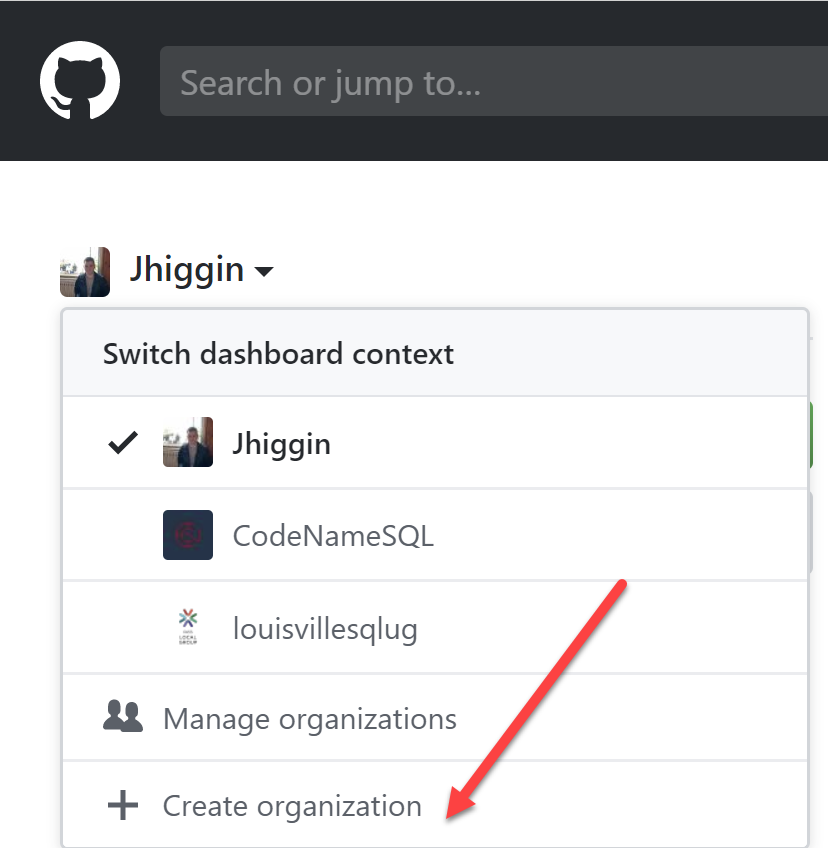
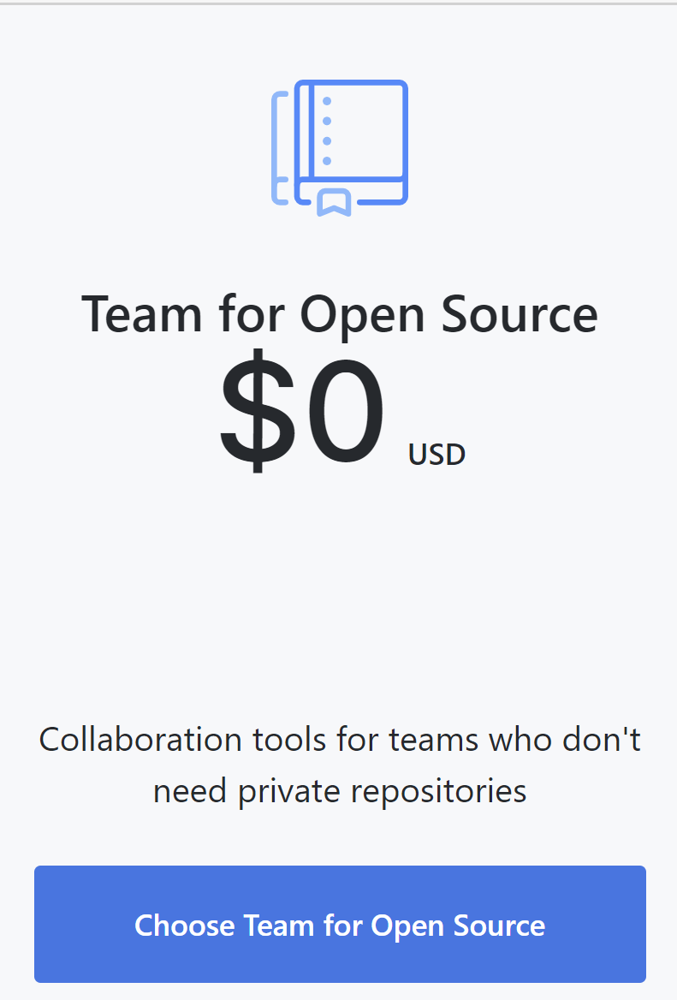
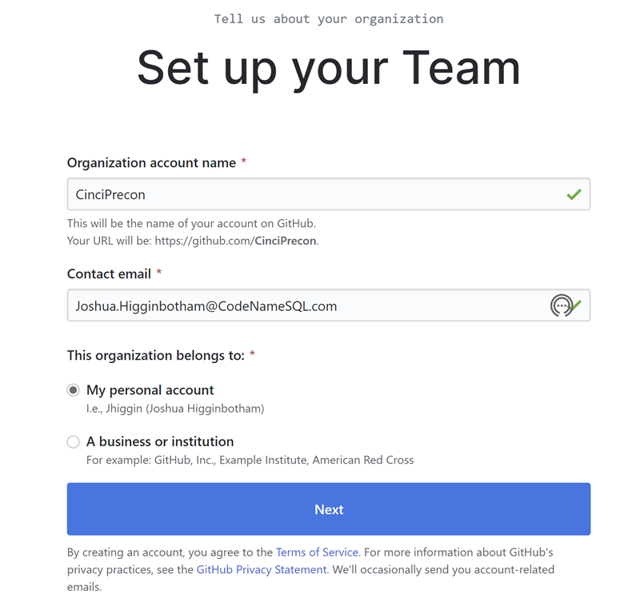
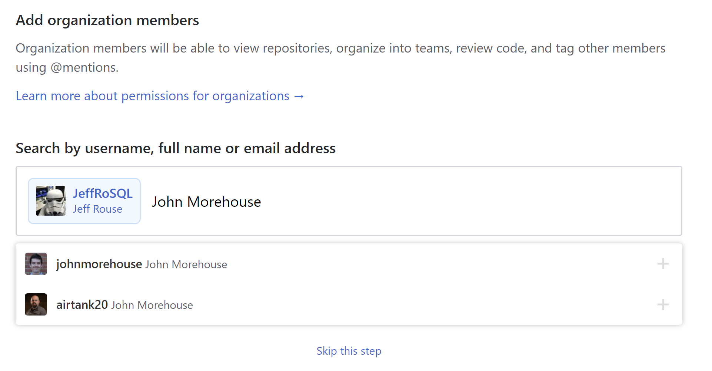
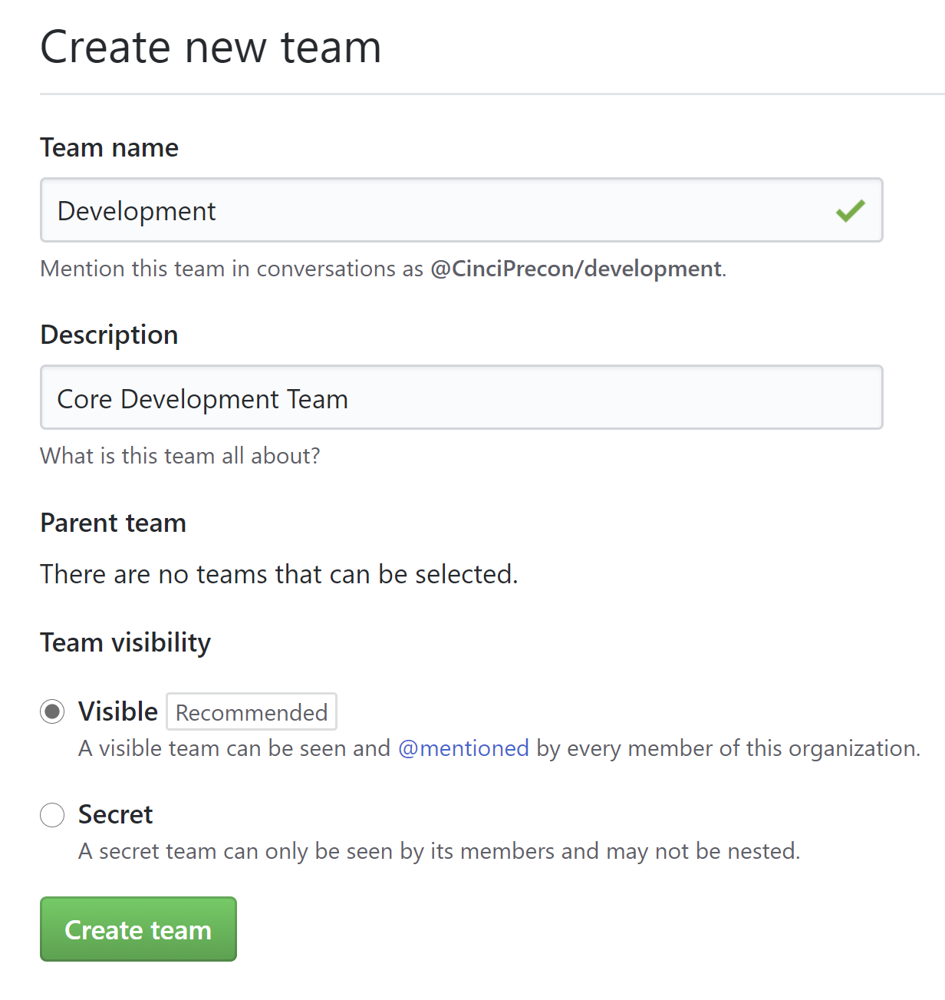
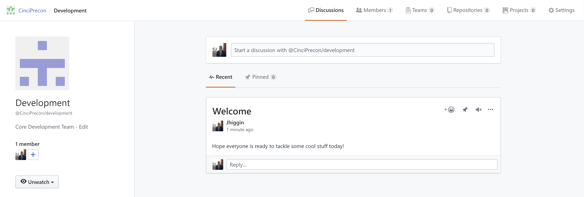
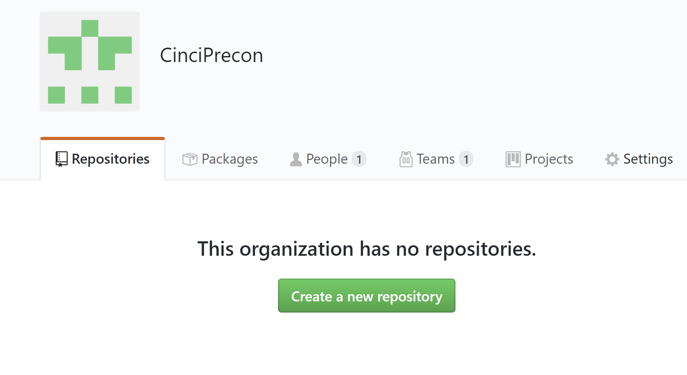
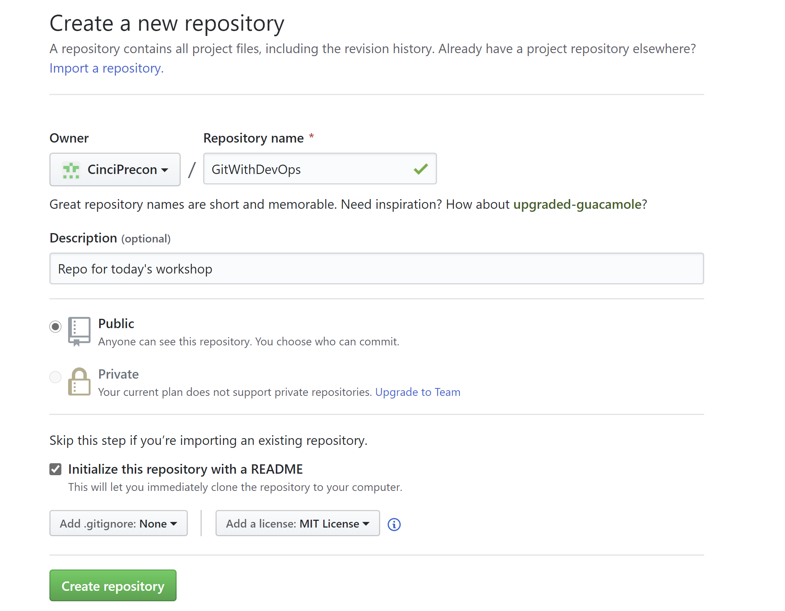

***Creating and Securing a Remote Project in GitHub***

***Topics Covered***
- [Creating an Organization](#creating-an-organization)
- [Creating Teams for Controlling Access](#creating-teams-for-controlling-access)
- [Creating your First Repository](#creating-your-first-repository)
- [Setting up Notifications](#setting-up-notifications)
- [Creating Templates for Reporting Changes to the System](#creating-templates-for-reporting-changes-to-the-system)
- [Setting up Branch Protection](#setting-up-branch-protection)
- [Defining Pull Requests](#defining-pull-requests)

- [Back to the Main Page](../../README.md)
  

### Creating an Organization
First off, we need to create an organization that our company can work from.  To create an organization, login to your GitHub account and select the create an organization switch under you account like below.

Here, we need to select the type of organization that we will want for this team.  In this case, free is our friend.  

We then need to give GitHub a little bit of info related to what this organization is about.  We will define a name for the Org, a contact email for communication, and who the organization belongs to.  In an official project outside of today, setting the owner of the organization is not the best option.  As if that person ever leaves the company or if the relationship between that person falls.  GitHub will not be able to adjust this from their ownership without permission.

### Creating Teams for Controlling Access

Now that we have our Organization created, we need to invite some of our initial members to help us out. To add members, you can input their name, GitHub account, or email address.  This will send them an invite that will request them to accept before they are added to the organization as a member.

Once we have the members of our team added, we need to create teams based off responsibilites around our organization.  We will keep it easy today and just create a team for the core developers of the system.

Inside a team, we can find a discussion area were communication can be found related to what the team is working on as well as key areas related to what the team is doing.  These areas include repositories that the team have permission to and projects that the team is working on.

### Creating your First Repository

So now that we have the team defined, lets create our first repository.  To create a repository, we will go back to the main page of the organization as select the Create a new repository button below. 

We then need to provide details around the repository.  We'll provide a descriptive name, a description as to what the project is for, will this be a public repo or private (in this case public) and then we will initialize the repo with a Readme file and set the license to MIT like below.

### Setting up Notifications
### Creating Templates for Reporting Changes to the System
### Setting up Branch Protection
### Defining Pull Requests