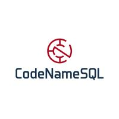

# It's time to Git with DevOps - PreCon

Welcome and thank you for taking time to attend today's session of Git and DevOps.  In today's session, we will cover everything you need to know to get started with Git and building a strong DevOps foundation for success.

***Today's Topics***
- Creating and securing your Remote Git Environment
- Defining Effective Branch Strategies
- Working with Git Locally to support a DevOps philosophy
- Working with TsqlT to test your code
- Building out a CI/CD Pipeline for automated releases

***More to Come***
